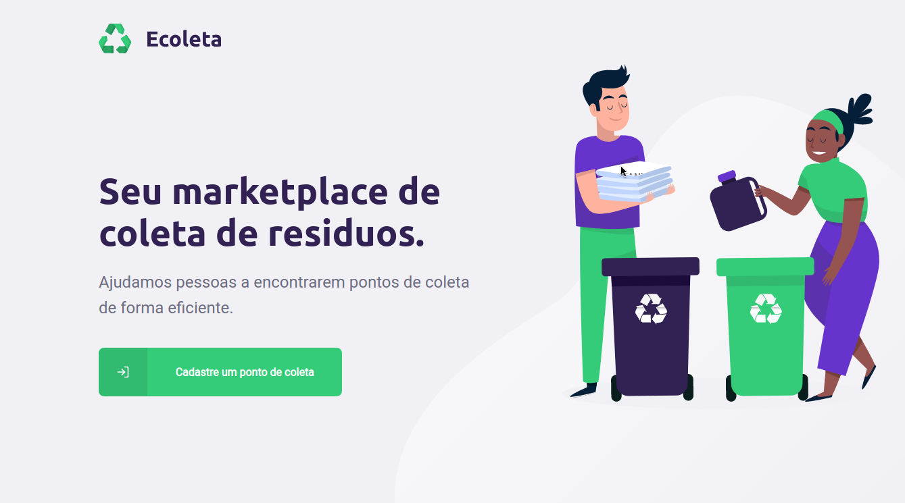

<h1 align="center">
  
</h1>

## Descrição
  Ecoleta é uma aplicação que tem o objetivo de ajudar as pessoas a encontrarem pontos de coleta de itens recicláveis.
  Inicialmente desenvolvida na NLW#01 (evento produzido pela <a href='https://rocketseat.com.br/'>Rocketseat<a>).
  

## Tecnologias utilizadas
- <a href='https://nodejs.org/en/'>Node.js</a>
- <a href='https://reactjs.org/'>React.js</a>
- <a href='https://www.typescriptlang.org/'>Typescript.js</a>

## Licença
  Projeto sob a licença MIT. Veja <a href='https://github.com/cassiopieroni/ecoleta-nlw/blob/master/LICENSE'> LICENSE </a> para mais detalhes.